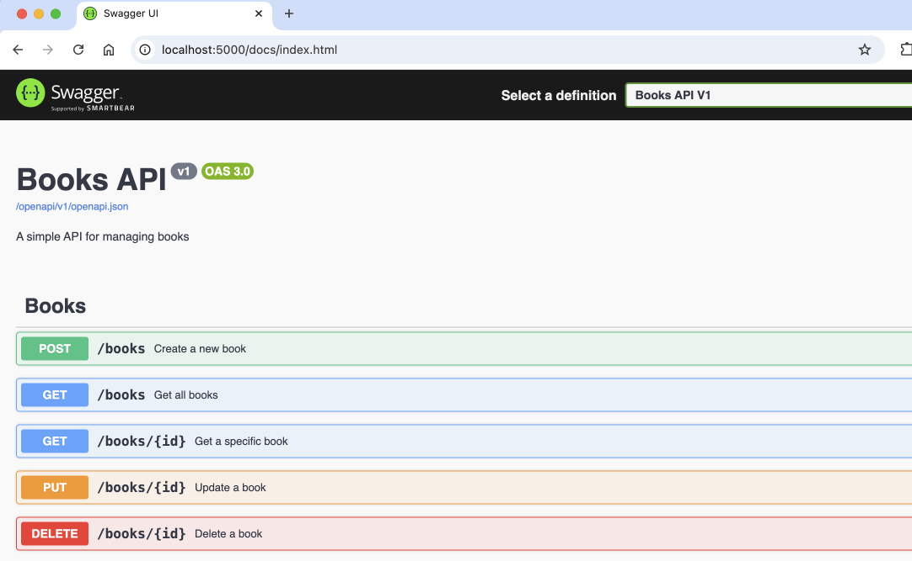
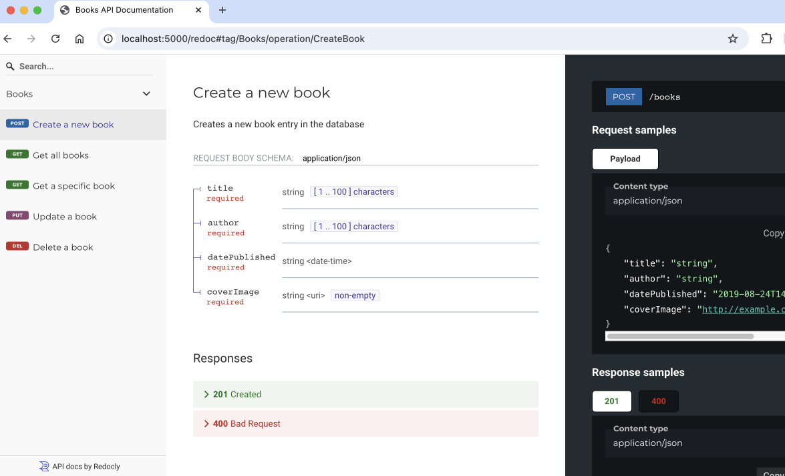

# swift-api-rest-cs

REST Web API using C# and ASP.NET Core

## Setup

* [Setup for macOS](./docs/setup-macos.md)

## Run

Configure project:

```bash
source configure.sh
```

Run:

```bash
./watch.sh
```

Browse the docs and test the API via the Swagger UI:

```bash
open http://localhost:5000/docs
```



Browse the docs using Redoc. This is an alternative to the Swagger UI:

```bash
open http://127.0.0.1:5000/redoc
```



## Test

Run unit tests:

```bash
dotnet test
```

## Database Migrations

> If you want to use migrations

Add first migration and initialize the database:

```bash
dotnet ef --project swift-api migrations add InitialCreate
```

Create database:

```bash
dotnet ef --project swift-api database update 
```

Point `.env` to the new database:

```bash
echo 'DATABASE_URL=sqlite:///./swift-api/books.db' > .env
```

Run the application:

```bash
dotnet run
```

## Run in Podman / Docker 

> In order to do this you will need Podman. See [Setup Podman on macOS](./docs/setup-podman-macos.md) for details.

Rebuild container image and start container:

```bash
./podman.sh
```

Delete container and image:

```bash
./podman-delete.sh
```

## How to create a new project

Activate `dotnet`:

```bash
export DOTNET_ROOT=$HOME/.dotnet
export PATH="$HOME/.dotnet:$PATH"
```

#### Create .net solution

```bash
dotnet new sln --name swift-api
```

#### Create C# project

```bash
# add web project
dotnet new web --name swift-api --framework net8.0
dotnet sln add swift-api

# add packages
dotnet add swift-api package DotNetEnv
dotnet add swift-api package Microsoft.EntityFrameworkCore
dotnet add swift-api package Microsoft.EntityFrameworkCore.Design
dotnet add swift-api package Microsoft.EntityFrameworkCore.Sqlite

dotnet add swift-api package Microsoft.AspNetCore.OpenApi
dotnet add swift-api package Swashbuckle.AspNetCore

# add test project
dotnet new xunit --name swift-api-tests
dotnet sln add swift-api-tests

dotnet add swift-api-tests package Microsoft.EntityFrameworkCore.InMemory
dotnet add swift-api-tests package Microsoft.AspNetCore.Mvc.Testing

# add reference to the main project
dotnet add swift-api-tests reference swift-api

# add tools
dotnet tool install --global dotnet-ef
```
